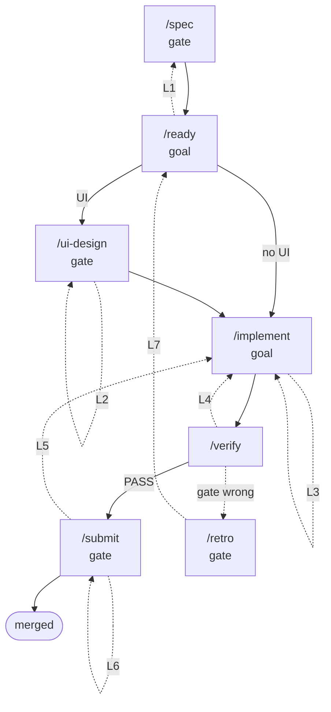

# Feature Development Loop

How the phase skills work together to drive an issue from idea to merged code.

This is a **loop**, not a pipeline: phases can route work backwards, and two phase interiors
run unattended under `/goal` until a printed condition holds.

## Overview



Reading it:

- **Solid** is the forward path. **Dotted** is a reverse edge, and the reverse edges are the
  point — a pipeline without them fails later and more expensively.
- **gate** means a human decides before the phase advances. **goal** means the phase interior
  runs unattended under `/goal` until a printed condition holds.
- **L1** through **L7** are the seven loops, described next.

## The seven loops

Each one has a trigger, an exit condition, and something that caps it. A loop with no cap is
how a phase runs forever; a loop with no printed exit condition is how it stops too early.

### Level 1 — inside a phase

**L2 · Design iteration** — `/ui-design`
- Trigger: a committee reviewer returns a blocking finding.
- Exit: no blocking findings left **and** you approve the pass. Both, not either.
- Cap: the `effort/` tier. S gets one pass, M two, L three. After the last pass, present the
  best version and let the user approve, take over, or defer.

**L3 · TDD cycle** — `/implement`
- Trigger: the next task in the approved plan.
- Exit: the failing test passes and the refactor is clean.
- Cap: none, and it needs none. It is per task, and the plan bounds the task list.

**L5 · Review committee** — `/submit`
- Trigger: a lens returns a blocking finding.
- Exit: zero blocking findings across the lenses the size gate turned on.
- Cap: the `effort/` tier again. Non-blocking findings are logged to the issue and dropped, so
  the loop cannot be kept alive by style preferences.

### Level 2 — between phases

**L1 · Spec repair** — `/ready` → `/spec` → `/ready`
- Trigger: `DOR VERDICT` with `route=/spec`. Scope is XL, requirements are missing, or an AC
  cannot be made observable without inventing what the author meant.
- Exit: a later `/ready` run prints `status=PASS`.
- Cap: human. `/spec` is gated, so this loop cannot spin unattended.

**L4 · Definition of Done** — `/implement` → `/verify` → `/implement`
- Trigger: `DOD VERDICT` with `route=/implement`.
- Exit: `status=PASS` or `status=PASS-with-caveats`.
- Cap: the goal's turn limit, plus a circuit breaker — if the same criterion fails three runs
  in a row, stop and report. The problem is not the implementation at that point.
- This is the only loop that runs fully unattended, which is why `/verify` is forbidden from
  editing code or the acceptance test. Both would close the loop by removing the signal.

**L6 · Human review** — after the MR exists
- Trigger: review comments or a CI failure.
- Exit: approval.
- Cap: human. `/loop` polls for the comments because they arrive on someone else's schedule;
  this is the only place `/loop` belongs.

### Level 3 — across issues

**L7 · Process repair** — `/retro`
- Trigger: any failure anywhere above. A DoR fail, a blocking finding, a failed DoD, a defect
  that reached production.
- Exit: an amendment open for review in the config repo, or a recorded one-off.
- Cap: the recurrence test. Amend only what would happen again; everything else gets a
  `LEARNINGS.md` line and stops.
- **This loop does not help the issue in front of you.** It changes the gate so the next issue
  does not repeat it. Skipping it is what turns the whole thing back into a straight line.

### Where each loop is closed

`/goal` closes L4 and the `/ready` interior. Human gates close L1, L2, L5, L6, and L7. Nothing
closes L3 but the code.

## The primitives and what each is for

Four different mechanisms, no overlap. Picking the wrong one is the most common mistake.

- **Skills** carry the standards. `/ready` holds the Definition of Ready rubric, `/verify`
  holds the Definition of Done procedure. They document what good looks like. They do not
  contain iteration counters.
- **`/goal`** drives phase interiors. It re-runs a turn until a condition holds, so a phase
  that needs "keep fixing until tests are green" uses a goal rather than hand-written loop
  logic. One goal per session, so goals are set per phase, never per feature.
- **Fresh-context `Agent` calls** are the review committees. The builder never grades its own
  work.
- **`/loop`** polls external state that changes without you: CI status and MR comments after
  `/submit`. Nothing else.

### The constraint that shapes every exit condition

The `/goal` evaluator **does not call tools**. It only judges what has been printed into the
conversation. Therefore every phase exit condition must be provable by a printed artifact:

- Good: a `DOR VERDICT:` line, a `DOD VERDICT:` line, a test summary with a failure count, a
  results file path with `status: PASS`.
- Useless: "the design is good", "the code is clean", "acceptance criteria are met" with
  nothing printed that shows how.

This is why the Definition of Done is a harness run. It produces a PASS/FAIL the evaluator can
read. Prose cannot close a loop.

## Definition of Ready

An issue is ready to implement when all of these hold. `/ready` audits them and prints a
pass/fail line per criterion.

- **R1 User stories** — at least one, in role/action/benefit form, each with acceptance
  criteria.
- **R2 Observable acceptance criteria** — every AC names a UI element or an app state a test
  can assert. "Feels responsive" fails. "Tapping `saveRecipeButton` shows `recipeSavedToast`
  within 2s" passes.
- **R3 Identifier contract** — every element an AC references has a named
  `accessibilityIdentifier`. Without this the DoD test cannot be written.
- **R4 Design artifact** — user-facing work has approved screens meeting the platform's
  interface guidelines (Apple HIG on Apple platforms) and the app's existing aesthetic. Missing design routes to `/ui-design`, not to `/spec`.
- **R5 Technical approach** — the types and files to touch, the data flow, and the decisions
  already made. An implementer can start without re-deriving the architecture.
- **R6 Bounded scope** — an `effort/` label is present and is not XL. XL routes back to
  `/spec` to be split.
- **R7 DoD test exists** — an acceptance test in the project's own harness whose
  `success_criteria` map one-to-one onto the acceptance criteria. On Apple platforms that is
  an AXe YAML under `scripts/uitests/`; on web it is the named Playwright flow. Non-UI work
  names the unit or integration tests instead.

- **R8 Gate is set** — exactly one `gate:` label is present (`gate:machine`, `gate:human`, or
  `gate:mixed`), naming who can close the issue and whether an unattended loop may touch it.
  `/spec` sets it at sizing time; `/ready` refuses an issue whose gate is unset. This is the
  routing axis, and it is what makes the pull query below possible.

R7 is the load-bearing one. **The acceptance test is authored before any code**, which is
what makes the Definition of Done objective rather than aspirational.

## The routing axis

`value/`×`effort/` answers *how important and how big*. It does not answer *who can close this,
and can the loop touch it* — a second, orthogonal axis carried by a small set of labels:

- **`gate:machine` · `gate:human` · `gate:mixed`** — who closes it. R8, set at `/spec`, required
  by `/ready`.
- **`unattended`** — safe for the loop to pull with no human and no hardware. Set by `/ready`.
- **`blocked`** — a dependency must clear first. Set and cleared as dependencies move.
- **`needs-design`** — must go through `/ui-design` before it can be built. Set when design is
  missing; **cleared by `/ui-design` on its final approved pass**, so it never goes stale (single
  owner). It mirrors what `/ready`'s R4 route computes fresh, so it is a convenience for querying,
  not a second source of truth.

A loop that wants a next item it can actually finish queries the label side:

```
highest value/, lowest effort/, unattended AND gate:machine, NOT blocked
```

The consuming loop adds its own open/status filter on top (a Project board's `status=Todo`, or
just "issue is open"). That board and its status field live in the consuming repo, not in
dev-jawn — dev-jawn only exposes the labels the query needs.

Both axes are defined once, with colors and descriptions, in
`plugins/dev-jawn/scripts/setup_labels.sh`. A project adopts the taxonomy by running that script
once (`bash plugins/dev-jawn/scripts/setup_labels.sh`); see `plugins/dev-jawn/README.md` for the
full table and the GitLab translation.

**`polish` (✨) is a work-type tag, not routing.** It answers neither "who closes it" nor "can
the loop touch it," so it stays out of the Definition of Ready and out of the pull query. Treat
it like `bug` or `documentation`: a category, not a gate.

## Definition of Done

Three things hold, and `/verify` is what establishes them:

- The unit suite is green, with pristine output.
- The acceptance test written at `/ready` passes against the built app.
- Every acceptance criterion reconciles to the channel that observed it. An AC with nothing
  reporting on it is a FAIL, not a skip. This is the check that catches a green suite that
  never exercised half the feature.

`/verify` detects the platform, runs the right harness, writes
`scripts/uitests/results/YYYY-MM-DD_HHMM_<name>.md`, and prints:

```
DOD VERDICT: #347  status=FAIL  criteria=7/9  unit=green  acceptance=FAIL  results=<path>  route=/implement
```

A code failure routes to `/implement`. A test that asserts something the acceptance criteria
never said routes to `/retro`, because then the gate is wrong rather than the code.

## The phases

### `/spec <description>` — human gated

Unchanged in shape: product-manager, then ux-designer, then a gate, then the architect,
sizing, and issue creation. Two additions:

- Acceptance criteria must be written in the observable form R2 requires.
- The UX section names the `accessibilityIdentifier` for every element an AC references.

Ends by printing the `/goal` command for `/ready`.

### `/ready #N` — unattended under `/goal`

Audits the issue against the Definition of Ready, **repairs what it can**, and routes what it
cannot. It rewrites vague ACs into observable form, names missing identifiers, derives the
acceptance test, creates the feature branch, and commits the test.

Prints a fixed verdict line the goal evaluator reads:

```
DOR VERDICT: #347  status=PASS  passed=7/7  blocking=none  route=/ui-design
```

Routes: `/spec` when the problem is scope or missing requirements, `/ui-design` when only the
design is missing, `/implement` when ready and no UI work is needed.

### `/ui-design #N` — human gated

Design passes, up to the count the size gate allows. Each pass builds the **real view**, not a
throwaway mock, and drives it for the empty, typical, and stress states: Playwright against a
live prototype URL on web, `mcp__xcode__RenderPreview` on Apple platforms. Then a committee of
fresh-context agents reviews it on fixed non-overlapping lenses:

- Acceptance criteria coverage across all three states
- Accessibility: keyboard path and focus order, contrast, tap target size; VoiceOver and
  Dynamic Type on Apple platforms, WCAG on web
- Platform conventions and fit with the app's existing aesthetic

Each reviewer returns a **blocking finding count**. Only blocking findings force another
pass; non-blocking findings are logged to the issue and dropped. Without that rule three
passes always runs three passes.

On Apple platforms the final pass builds and drives the view in the simulator with AXe, so the
design is confirmed interactively using the same harness that will run the DoD test.

You approve each pass. Taste is not delegated.

### `/implement #N` — unattended under `/goal`

Plan mode and plan approval are still a human gate. After the plan is approved, the
implementation runs under a goal whose exit condition is a `DOD VERDICT` line with
`status=PASS`. `/verify` runs inside that loop and produces it.

Two rules hold no matter how many times the loop runs: the acceptance test is never edited to
make it pass, and no unit test is weakened. Both are the same failure — removing the only
signal that says whether the work is done.

### `/submit` — human gated

Confirms a `DOD VERDICT` exists for the issue, then runs a code review committee in fresh
contexts before the MR is opened, on fixed lenses added in this order by the size gate:

- Correctness against the acceptance criteria
- Platform safety, via the domain reviewer: Swift concurrency and main-actor safety on Apple
  platforms, the `python-code-reviewer` or `cpp-qt-reviewer` skill elsewhere
- Test adequacy: would each test still fail if the fix were reverted

Blocking findings stop the submission; non-blocking ones are logged and dropped. After the MR
exists, `/loop` handles polling for CI and review comments.

### `/retro` — after any failure

When DoR fails, a committee blocks, or the DoD test fails, name the gate that should have
caught it, amend that gate, and record the entry. Without this the loop is a longer straight
line.

The amendment lands in the **config repo**, on its own branch, because the phase skills are
symlinked from there. It is a separate submission from the fix for the issue.

Amend only what would recur. A retro that files an amendment for every failure buries the
rubric in special cases until nobody reads it, which is the same as having no rubric. A
genuine one-off gets a `LEARNINGS.md` line and nothing more.

## Size gating

Committee cost scales with the `effort/` label. `/ready` records the gate in the issue so
later phases do not re-derive it.

- **effort/S** — one design pass, one reviewer, one code reviewer.
- **effort/M** — up to two design passes, two lenses, two code lenses.
- **effort/L** — full three passes, three lenses, three code lenses.
- **effort/XL** — does not pass DoR. Split it first.

## Gates

Nothing crosses these without you.

- `/spec` after UX: ready for architecture?
- `/spec` after issue: ready for the next phase?
- `/ui-design` each pass: approve, iterate, or stop?
- `/implement` after plan: plan approved?
- `/submit` after review: merge?

`/ready` and `/verify` have no gate. Each one passes, repairs, or routes, and every outcome is
printed.

`/retro` proposes an amendment to a standard you rely on across every project. It never lands
one on its own.

## Entry points

- Fresh idea: `/spec <description>`
- Existing issue of unknown quality: `/ready #N`
- Ready issue with a UI: `/ui-design #N`
- Ready issue, no UI: `/implement #N`
- Code already written: `/submit`
- Something got through that should not have: `/retro`

**Default to `/ready` for anything already filed.** It is cheap when the issue is in good
shape and it is the whole point when it is not. Going straight to `/implement` requires that
the issue already carries a passing `DOR VERDICT` and its committed acceptance test, or that
Joe said to skip the gate.

## Standalone utilities

- `/git-analysis` — repository health, not part of the loop.
- `/verify #N` — run the DoD test on demand, outside `/implement`.
